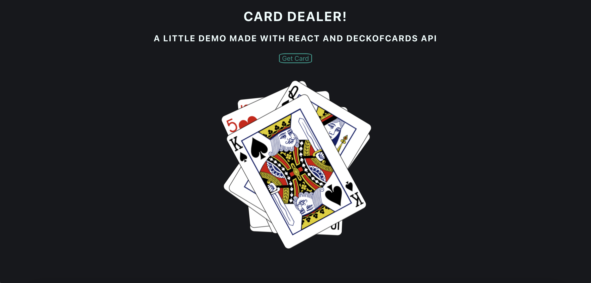

# Card Dealer

Showing of a random card from a API


## API Reference

#### Get all items

```http
  GET https://www.deckofcardsapi.com/api/deck/new/shuffle/?deck_count=1
```
Add deck_count as a GET or POST parameter to define the number of Decks you want to use. Blackjack typically uses 6 decks. The default is 1.


| Parameter | Type     | Description                |
| :-------- | :------- | :------------------------- |
| `deck_key` | `string` | **Required**. Your API key |

#### Get item

```http
  GET ${API_BASE_URL}/${id}/draw/
```

| Parameter | Type     | Description                       |
| :-------- | :------- | :-------------------------------- |
| `id`      | `string` | **Required**. Id of item to fetch |


  ## Color Reference

| Color             | Hex                                                                |
| ----------------- | ------------------------------------------------------------------ |
| Example Color |  #0a192f |
| Example Color |  #f8f8f8 |
| Example Color |  #00b48a |
| Example Color |  #00d1a0 |

# DEMO




## 🛠 Skills
Reactjs, HTML, CSS...


